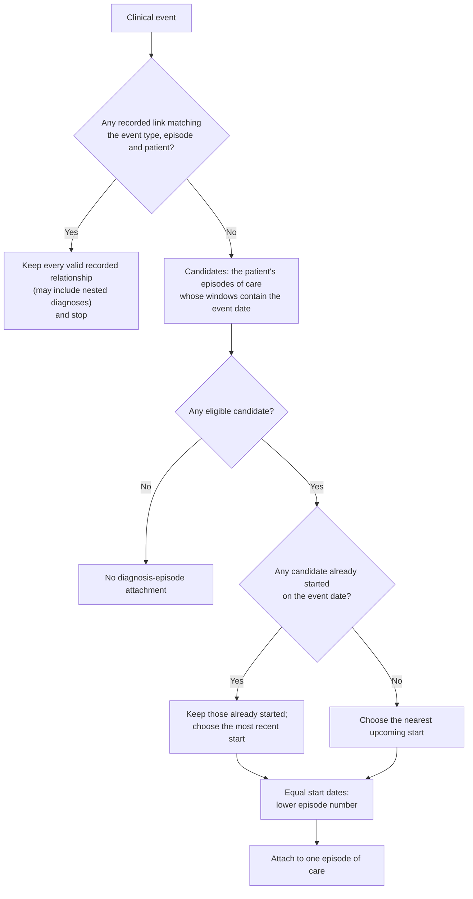
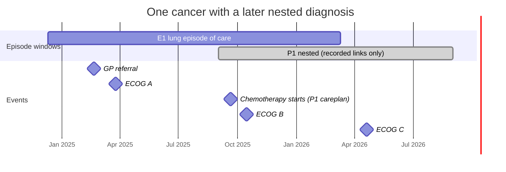
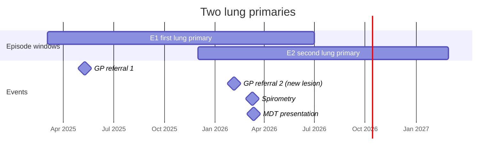

# Episode attachment and measure resolution

The first part explains the intended rules for clinicians. The second part records their developer contracts and implementation status. The examples apply the rules below and identify results that depend on an unresolved decision.

## Part 1: for clinicians

### The unit of a report

A report row describes one patient's cancer from its diagnosis: one **episode of care** per top-level MOSAIQ diagnosis. A diagnosis recorded under another diagnosis is a **nested diagnosis**. It belongs to the same cancer and does not create a cohort row under the primary-diagnosis assumption below.

Treatment careplans, surgery and diagnosis details reach an episode through the diagnosis recorded in the source. Measurements, assessments, procedures and observations use valid recorded episode links when available; otherwise they use the date-window rules below. Specialist visits have a separate attachment rule.

!!! note "Assumption: cohorts select through the primary diagnosis"
    Every leaf measure reachable from a cohort definition must select through the **primary diagnosis** (`dx_primary`). Under this assumption, each cohort row identifies an episode of care. A nested diagnosis is not a cohort row even when its diagnosis codes match the cohort definition.

    Cohorts defined through any diagnosis (`dx_any`), stage (`dx_stage`) or metastasis (`dx_mets`) can select nested diagnoses and need a different cohort contract. Enforcing the primary-diagnosis restriction during configuration import is not yet decided.

Two top-level diagnoses for one patient are treated as true second primaries, so the patient can have two cohort rows. Duplicate entry of one cancer as two top-level diagnoses is assumed to be managed through clinical data review; these rules do not merge those diagnoses.

### Attachment rules

| Area | Behaviour |
|---|---|
| Recorded event links | Keep every link that matches the event, its type, the episode and the patient; suppress date-window fallback for that event |
| Date-window attachment | Choose one eligible episode of care; nested diagnoses are not fallback candidates |
| Window | From 90 days before the episode starts to its recorded end date, or start + 365 days when no end is recorded; extending it for nested diagnoses remains open |
| Measure criteria | Apply exclusions as exclusions; combine AND and EXCEPT on the complete patient-and-episode member identity |
| Indicator evaluation | Use one shared calculation for every output; whole-cohort matching grain remains open |

### Step 1: how a clinical event finds an episode

1. **Recorded links.** Validate each recorded relationship against the event ID, kind of event, episode and patient. Keep every valid relationship, including relationships to nested diagnoses and relationships outside the date window. An event can retain several valid links. It does not also enter date-window fallback.
2. **Date window.** For an event without a valid recorded link, consider the patient's episodes of care whose windows contain the event date. Each window starts **90 days before** the episode starts and closes at its recorded **end date**, or **365 days after** its start when the end date is absent. How to cover later nested diagnoses is open (question 1).
3. **Choosing one.** Prefer candidates that had already started on the event date, then choose the most recent start. If none had started, choose the nearest upcoming start. Resolve equal starts using the lower episode number. Attribution before diagnosis and policies for different kinds of event remain open (questions 4 and 5).
4. **No candidate.** The event has no diagnosis-episode attachment through this route, so an indicator using these diagnosis-linked event views cannot use it.

For specialist visits, the 1.0 target is a separate ranking by tier, distance from the episode start in either direction, and stable episode ID. The exact 180-day boundary still needs to be settled and tested.

### Step 2: how the report decides whether a patient qualifies

1. **Cohort.** Create one cohort row per episode of care that meets the cohort definition, dated at diagnosis. This depends on the primary-diagnosis assumption above.
2. **Criteria inside a measure.** A rule set with inclusions and exclusions selects rows that meet an inclusion and no exclusion. OR combines qualifying members without duplicating their identity. AND requires evidence for the same patient and episode. EXCEPT retains members selected by its first child that are not selected by the other children; unsupported combinations must be rejected rather than evaluated as AND.
3. **Denominator and numerator.** For a **defined denominator**, both denominator and numerator must align with the cohort's episode of care. For a **whole-cohort** indicator, whether qualifying evidence must align with the same episode of care or can match at patient level remains open (question 2). Evidence must satisfy the indicator's date window in either case.
4. **One calculation.** A shared evaluator determines eligibility, anchors, windows and null-date handling. Every output serialises the same result.

### Worked example 1: one cancer with a later nested diagnosis

- **E1** is a lung episode of care diagnosed 10 March 2025, with no recorded end date. Under the stated window rule, its window runs from 10 December 2024 to 10 March 2026.
- **P1** is brain metastases recorded beneath the lung diagnosis from 1 September 2025. It can receive valid recorded links but is not a date-window candidate.

| Event | Attachment under the stated rules | Reason or unresolved decision |
|---|---|---|
| GP referral, 20 Feb 2025 | E1 | Its date is inside E1's window |
| ECOG A, 25 Mar 2025 | E1 | Its date is inside E1's window |
| Chemotherapy careplan recorded against the brain-metastases diagnosis | P1 | Whether this treatment counts for E1 is question 3 |
| ECOG B, 15 Oct 2025 | E1 | P1 is not a date-window candidate |
| ECOG C, 20 Apr 2026 | No attachment | E1's window has closed; extending it for P1 is question 1 |

For the E1 cohort row:

| Indicator | Kind | Result under the stated rules |
|---|---|---|
| ECOG documented | Whole cohort | Met: ECOG A is on E1 |
| Received systemic therapy | Whole cohort | Depends on whole-cohort matching and treatment on nested diagnoses (questions 2 and 3) |
| Stage III NSCLC with ECOG 0–2 | Defined denominator | Met if stage III is on E1 and its ECOG evidence meets the criterion and date window |
| Stage III NSCLC who received systemic therapy | Defined denominator | Treatment on P1 does not meet direct episode matching for E1; whether it should count is question 3 |

ECOG C demonstrates the unresolved window question. It occurs during the same cancer's later care, but after E1's 365-day window closes. Keeping only episodes of care as fallback candidates leaves it unattached unless E1's window is extended to cover later nested diagnoses. This extension needs a clinical decision.

### Worked example 2: two lung primaries

- **E1** is the first lung primary, diagnosed 1 June 2025, with a recorded end of 30 June 2026. Its window runs from 3 March 2025 to 30 June 2026.
- **E2** is the second lung primary, diagnosed 1 March 2026, with no recorded end date. Its window runs from 1 December 2025 to 1 March 2027.

| Event | Attachment under the stated rules | Why |
|---|---|---|
| GP referral 1, 10 May 2025 | E1 | Only E1's window contains it |
| GP referral 2 for the new lesion, 5 Feb 2026 | E1 | Both windows contain it, but only E1 had started |
| Spirometry, 10 Mar 2026 | E2 | Both had started; E2 has the more recent start |
| MDT presentation, 12 Mar 2026 | E2 | As for spirometry |

The spirometry and MDT attach once, to E2. The referral for the new lesion attaches to E1 under the already-started preference, so it cannot start an E2 referral-to-specialist or referral-to-treatment calculation through episode-aligned matching. Whether a pre-diagnosis event should prefer the upcoming diagnosis is question 4.

Ranking by dates alone does not establish which cancer an event concerns. If E2 were a prostate primary, the lung MDT would still attach to E2 under this rule. Whether attachment should use the kind or content of an event is question 5.

## Part 2: for developers

### Attachment contract (`omop-constructs`)

<!-- table TODO once completed -->

View-definition changes require a rebuild, followed by immediate ANALYZE in dependency order. See [Rebuilding and refreshing clinical materialized views](schema_management.md#rebuilding-and-refreshing-clinical-materialized-views).

### Measure and indicator contract (`oa-cohorts`)

<!-- table TODO once completed -->