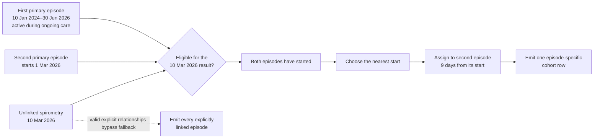

# Reporting and Measure Execution Model

`oa-cohorts` defines the core domain model for building reusable cohort logic, compiling it to SQL, and materialising time-stamped qualification events for downstream reporting.

Every executable unit ultimately resolves to a set of [`MeasureMember`](measure_resolution.md) rows:

```text
{person_id, episode_id, measure_resolver, measure_date}
```

That canonical shape lets reports, indicators, and dashboards reuse the same underlying logic while preserving timing and episode alignment.

Diagnosis-related measurements, procedures, and observations with valid explicit episode relationships retain those relationships. An unlinked event is assigned to one eligible episode of care by preferring an episode already started on the event date, then the nearest episode start, and finally the lowest episode identifier.

For example, suppose a patient's first lung cancer episode starts on 10 January 2024 and remains active during ongoing care through 30 June 2026. A second primary lung cancer episode starts on 1 March 2026, and an unlinked spirometry result is recorded on 10 March 2026. Both episodes are eligible and have already started, so the ranked fallback assigns the result to the second episode because its start is nearest to the measurement date. A valid explicit relationship bypasses this fallback: a relationship to the first episode assigns the result there, while valid relationships to both episodes retain both clinical assertions. The unlinked result therefore contributes one episode-specific cohort row rather than one row for every overlapping episode.



Note that if there has been a change to materialized-view definitions, installing the Python packages does not alter materialized-view definitions already stored in the database. You will need to rebuild any changed materialised views before running reports. Rebuild their dependent views in dependency order and ANALYZE each immediately after creating it. Refreshing a materialized view updates its data but does not replace its definition. See [Rebuilding and refreshing clinical materialized views](schema_management.md#rebuilding-and-refreshing-clinical-materialized-views) for the schema maintenance guidance.

---

## Conceptual Layers

### Layer 6: Report

A `Report` orchestrates cohort and indicator execution for a specific reporting context.

Reports:

* group together one or more dashboard cohorts
* execute cohort and indicator measures in a coordinated way
* treat `measure_id = 0` as the special "full report cohort" denominator
* assemble final output rows with preserved numerator and denominator dates

Reports do not compile measure SQL themselves. They consume `MeasureMember` results produced lower in the stack.


### Layer 5: Dash Cohort


A `DashCohort` defines a clinically meaningful population by grouping one or more cohort definitions, each of which wraps a single measure.

A cohort's members are the union of its underlying definitions. In downstream reporting systems those definitions can be surfaced as sub-cohorts for filtering or drill-down, but their primary role is to create a stable population boundary for indicator logic.


### Layer 4: Indicator

Indicators compose measures into:

* denominator: who is in scope
* numerator: which in-scope members met the target condition


Both numerator and denominator resolve independently to `MeasureMember` rows. Final report payloads keep both dates:

* `denominator_date`
* `numerator_date`

Indicator-level relative date windows are applied during payload assembly, not embedded in reusable measure definitions. This keeps measures broad and reusable while allowing different reports to impose different timing rules.


### Layer 3: Measure

A `Measure` is a recursive logical node that compiles to SQL and produces `MeasureMember` rows.

Measures can be:

* leaf measures backed by a single subquery
* composite measures backed by child measures

* Leaf: wraps a single subquery
* Composite: combination of child measures via OR / AND / EXCEPT
* Temporal window: event B relative to event A, with configurable bounds and pick strategy (see [`MeasureTemporalWindow`](measure_resolution.md#temporal-window-event-to-event-timing))

Measures are compiled by `MeasureSQLCompiler` and executed by `MeasureExecutor`.


### Layer 2: Subquery

A `Subquery` is the atomic SQL-producing unit.

It defines:

* a `RuleTarget`
* a `RuleTemporality`
* one or more `QueryRule` objects

Subqueries are responsible for:

* resolving the measurable class for their target
* choosing the field that each rule should inspect
* generating `ANY`, `FIRST`, and `UNDATED` SQL variants

All subqueries emit the canonical measure-member columns:

| Column | Meaning |
|---|---|
| `person_id` | individual identifier |
| `episode_id` | clinical episode |
| `measure_resolver` | logical alignment key, usually the episode id |
| `measure_date` | date on which the criterion was satisfied |

Rule handling inside a subquery:

* each rule contributes its own `WHERE` clause fragment
* rule-level selects are combined with `UNION ALL`
* `FIRST` collapses those candidate rows to the earliest qualifying date per resolver

Value-column resolution depends on the rule types present:

* exact, hierarchy, presence, and absence rules use a concept-like field
* substring rules use the measurable's string field
* predicate rules use the measurable's predicate field
* scalar rules always use the measurable's numeric field for threshold comparison
* scalar rules only require a concept field when at least one scalar rule has `concept_id != 0`

That last point is important for derived window measurables such as `tx_to_death_window` and `referral_to_specialist_window`: threshold-only scalar rules can run against numeric-only measurables.

`RuleTarget` selection also carries clinical meaning, not just technical routing. For example:

* `dx_any` resolves against any diagnosis row attached to the current episode
* `dx_primary` resolves against diagnosis rows anchored to the patient's primary diagnosis episode

That distinction lets report authors choose whether a cohort should follow episode-level diagnosis coding broadly, or whether it should stay anchored to the diagnosis present at the start of the primary episode of care.

### Layer 1: QueryRule

A `QueryRule` is the smallest declarative unit in the engine: a single predicate applied to a field resolved by a subquery.

Examples:

* diagnosis concept equals X
* numeric value is less than Y
* predicate column is true
* concept code contains substring Z

A rule does not generate a standalone query. It only contributes a `WHERE` clause fragment within a subquery.

---

## Why MeasureMember Rows Matter

The engine preserves qualification rows instead of reducing everything to a single boolean membership flag.

That supports:

* trend analysis over time
* indicator windows anchored to cohort membership dates
* episode-aware joins for `AND` logic
* multiple qualifying events per person when `OR` logic applies

This is the core design choice that makes the reporting layer flexible without forcing each report to redefine its own SQL.
